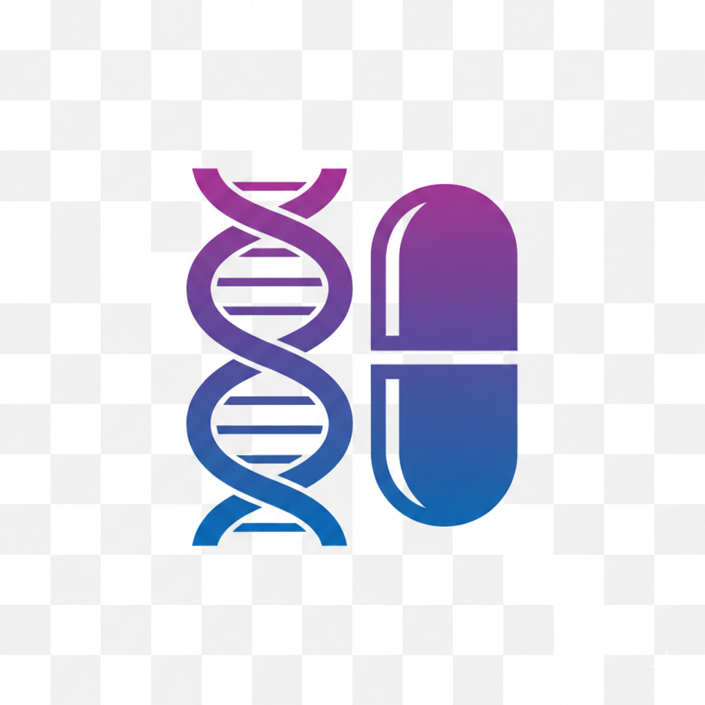

<p align="center">
  
</p>

<h1 align="center">🧬 PharmaGuard AI</h1>

<p align="center">
  <strong>AI-Powered Pharmacogenomics Drug Safety System</strong><br/>
  <em>Turning genetic code into safer prescriptions — one variant at a time.</em>
</p>

<p align="center">
  
  
  
  
</p>

<p align="center">
  👤 <strong>Team:</strong> Neuron.dev &nbsp;|&nbsp; 🧑‍💻 <strong>Developer:</strong> Ankit Kumar
</p>

---

## 🌐 Live Demo

> 🔗 **[https://your-demo-link.com](https://your-demo-link.com)**

---

## 🎥 Demo Video

> 📹 **LinkedIn:** [https://www.linkedin.com/in/your-profile/demo-video](https://www.linkedin.com/in/your-profile/demo-video)

---

## 📌 Table of Contents

- [Problem Statement](#-problem-statement)
- [Solution Overview](#-solution-overview)
- [Architecture](#-architecture)
- [Tech Stack](#-tech-stack)
- [Project Structure](#-project-structure)
- [Supported Drugs & Genes](#-supported-drugs--genes)
- [How It Works](#-how-it-works)
- [Getting Started](#-getting-started)
- [API Reference](#-api-reference)
- [Sample Output](#-sample-output)
- [Future Roadmap](#-future-roadmap)
- [Contributing](#-contributing)
- [License](#-license)

---

## ❗ Problem Statement

**Adverse Drug Reactions (ADRs)** are among the **leading causes of hospitalization and death** worldwide. According to the WHO, ADRs account for approximately **6.5% of hospital admissions** globally, with many being preventable.

The root cause? **One-size-fits-all prescribing.** Current clinical workflows rarely consider a patient's **genetic makeup** before prescribing medication, despite the fact that genetic variants in drug-metabolizing enzymes (CYP450 family, TPMT, DPYD, etc.) can drastically alter how a patient responds to a drug.

Key challenges:
- 🏥 **~2 million ADR cases** reported annually in the US alone
- 💊 Patients with **Poor Metabolizer (PM)** phenotypes face **toxicity risks** at standard doses
- 🧬 Pharmacogenomic data from VCF files is complex and not easily actionable by clinicians
- 📋 No accessible tool bridges the gap between **raw genomic data** and **clinical drug safety decisions**

---

## 💡 Solution Overview

**PharmaGuard AI** is an intelligent pharmacogenomics analysis platform that transforms raw genomic data (VCF files) into **actionable drug safety reports** powered by AI.

### ✨ What Makes It Unique

| Feature | Description |
|---|---|
| 🧬 **VCF Genomic Parsing** | Extracts pharmacogenomic variants (rsIDs) from standard VCF files |
| 🔬 **Genotype → Phenotype Mapping** | Maps genotype calls (0/0, 0/1, 1/1) to metabolizer phenotypes (NM, IM, PM) |
| ⚠️ **Drug Risk Classification** | Categorizes risk as **Safe**, **Adjust Dosage**, **Toxic**, or **Unknown** with confidence scores |
| 🤖 **LLM-Powered Explanations** | Uses Google Gemini AI to generate clinical-grade natural language explanations |
| 📊 **Structured JSON Reports** | Produces comprehensive, machine-readable pharmacogenomic reports |
| 💊 **Multi-Drug Analysis** | Analyze multiple drugs simultaneously against a patient's genetic profile |
| 🛡️ **Fallback Intelligence** | Graceful degradation with rule-based explanations when LLM is unavailable |

### 🎯 Innovation Factor

PharmaGuard AI doesn't just flag risks — it **explains them**. By combining deterministic pharmacogenomic logic with LLM-powered explainability, clinicians get both **data-driven assessments** and **human-readable clinical context** in a single report.

---

## 🏗️ Architecture

```
┌─────────────────────────────────────────────────────────────────┐
│                        🌐 Web Interface                        │
│                    (HTML/CSS/JavaScript)                        │
└──────────────────────────┬──────────────────────────────────────┘
                           │ HTTP POST (VCF + Drug + Patient ID)
                           ▼
┌─────────────────────────────────────────────────────────────────┐
│                      🖥️ Flask Backend                           │
│                        (app.py)                                 │
│  ┌──────────┬──────────┬──────────┬──────────┬──────────┐      │
│  │  Input   │   VCF    │Phenotype │  Risk    │  JSON    │      │
│  │Validator │  Parser  │ Engine   │ Engine   │ Builder  │      │
│  └────┬─────┴────┬─────┴────┬─────┴────┬─────┴────┬─────┘      │
│       │          │          │          │          │              │
│       ▼          ▼          ▼          ▼          ▼              │
│  validators  vcf_parser  phenotype  risk     json_builder       │
│    .py         .py      _engine.py engine.py    .py             │
└──────────────────────────┬──────────────────────────────────────┘
                           │
                           ▼
┌─────────────────────────────────────────────────────────────────┐
│                  🤖 Gemini AI (LLM Service)                    │
│            gemini_service.py → Google Gemini 2.0 Flash         │
│         Generates clinical pharmacogenomic explanations         │
└─────────────────────────────────────────────────────────────────┘
```

---

## 🛠️ Tech Stack

| Layer | Technology |
|---|---|
| **Backend Framework** | Python 3.10+ / Flask |
| **LLM Engine** | Google Gemini 2.0 Flash (`google-genai`) |
| **Genomics** | Custom VCF parser with rsID → Gene mapping |
| **Risk Engine** | Rule-based phenotype → risk classification |
| **Frontend** | HTML5, CSS3, Vanilla JavaScript |
| **Configuration** | python-dotenv (`.env`) |
| **Data Format** | Structured JSON (OrderedDict) |

---

## 📂 Project Structure

```
PharmaGuard/
├── app.py                          # Flask application entry point & API routes
├── config.py                       # Environment configuration (API keys)
├── requirements.txt                # Python dependencies
│
├── services/
│   ├── vcf_parser.py               # VCF file parser — extracts rsIDs & genotypes
│   ├── phenotype_engine.py         # Genotype → Phenotype mapping (PM/IM/NM)
│   ├── risk_engine.py              # Drug-gene risk classification engine
│   ├── gemini_service.py           # Google Gemini LLM integration
│   └── json_builder.py             # Structured JSON response builder
│
├── utils/
│   └── validators.py               # Input validation (file type, size, drugs)
│
├── templates/
│   └── index.html                  # Web UI (upload VCF, select drug, view results)
│
└── src/
    └── image.png                   # Project assets
```

---

## 💊 Supported Drugs & Genes

| Drug | Primary Gene | rsID | Clinical Relevance |
|---|---|---|---|
| **Codeine** | CYP2D6 | rs3892097 | Pain management — toxicity risk in PMs |
| **Clopidogrel** | CYP2C19 | rs4244285 | Antiplatelet — reduced efficacy in PMs |
| **Warfarin** | CYP2C9 | rs1057910 | Anticoagulant — bleeding risk in PMs |
| **Simvastatin** | SLCO1B1 | rs4149056 | Statin — myopathy risk in PMs |
| **Azathioprine** | TPMT | rs1142345 | Immunosuppressant — myelosuppression in PMs |
| **Fluorouracil** | DPYD | rs3918290 | Chemotherapy — severe toxicity in PMs |

### Phenotype Classification

| Genotype | Phenotype | Description |
|---|---|---|
| `0/0` | **NM** (Normal Metabolizer) | Typical enzyme activity |
| `0/1` | **IM** (Intermediate Metabolizer) | Reduced enzyme activity |
| `1/1` | **PM** (Poor Metabolizer) | Minimal enzyme activity |

---

## ⚙️ How It Works

```
  📄 VCF File Upload          💊 Drug Selection          🆔 Patient ID
        │                          │                          │
        └──────────────────────────┼──────────────────────────┘
                                   │
                                   ▼
                    ┌──────────────────────────┐
                    │   1. Input Validation     │
                    │   • File extension (.vcf) │
                    │   • File size (≤ 5MB)     │
                    │   • Drug supported?       │
                    └────────────┬─────────────┘
                                 ▼
                    ┌──────────────────────────┐
                    │   2. VCF Parsing          │
                    │   • Extract rsIDs         │
                    │   • Map to genes          │
                    │   • Extract genotypes     │
                    └────────────┬─────────────┘
                                 ▼
                    ┌──────────────────────────┐
                    │   3. Phenotype Engine     │
                    │   • Genotype → Phenotype  │
                    │   • PM / IM / NM          │
                    └────────────┬─────────────┘
                                 ▼
                    ┌──────────────────────────┐
                    │   4. Risk Classification  │
                    │   • Safe / Adjust / Toxic │
                    │   • Confidence scoring    │
                    │   • Severity assessment   │
                    └────────────┬─────────────┘
                                 ▼
                    ┌──────────────────────────┐
                    │   5. LLM Explanation      │
                    │   • Gemini 2.0 Flash      │
                    │   • Clinical context      │
                    │   • Fallback if offline   │
                    └────────────┬─────────────┘
                                 ▼
                    ┌──────────────────────────┐
                    │   6. JSON Report Builder  │
                    │   • Structured output     │
                    │   • Clinical recs         │
                    │   • Quality metrics       │
                    └──────────────────────────┘
```

---

## 🚀 Getting Started

### Prerequisites

- Python 3.10 or higher
- Google Gemini API Key ([Get one here](https://aistudio.google.com/apikey))

### Installation

```bash
# 1. Clone the repository
git clone https://github.com/ChikuX/PharmaGaurd.git
cd PharmaGaurd

# 2. Create a virtual environment
python -m venv venv
source venv/bin/activate        # Linux/macOS
venv\Scripts\activate           # Windows

# 3. Install dependencies
pip install -r requirements.txt

# 4. Configure environment variables
echo "GEMINI_API_KEY=your_api_key_here" > .env

# 5. Run the application
python app.py
```

The server will start at **http://127.0.0.1:5000** 🎉

---

## 📡 API Reference

### `POST /analyze`

Analyze a patient's VCF file against one or more drugs.

**Request:** `multipart/form-data`

| Field | Type | Required | Description |
|---|---|---|---|
| `vcf_file` | File | ✅ | VCF genomic file (`.vcf`, max 5MB) |
| `drug_input` | String | ✅ | Drug name(s), comma-separated (e.g., `Warfarin,Codeine`) |
| `patient_id` | String | ✅ | Unique patient identifier |

**Example Request (cURL):**

```bash
curl -X POST http://127.0.0.1:5000/analyze \
  -F "vcf_file=@patient_sample.vcf" \
  -F "drug_input=Warfarin" \
  -F "patient_id=PAT-001"
```

**Error Codes:**

| Code | HTTP Status | Description |
|---|---|---|
| `FILE_REQUIRED` | 400 | VCF file not provided |
| `INVALID_FILE_EXTENSION` | 400 | File is not `.vcf` format |
| `FILE_TOO_LARGE` | 413 | File exceeds 5MB limit |
| `DRUG_REQUIRED` | 400 | No drug specified |
| `UNSUPPORTED_DRUG` | 400 | Drug not in supported list |
| `VCF_PARSE_ERROR` | 400 | Malformed VCF file |

---

## 📋 Sample Output

```json
{
  "patient_id": "PAT-001",
  "drug": "Warfarin",
  "timestamp": "2026-02-19T12:00:00.000000Z",
  "risk_assessment": {
    "risk_label": "Toxic",
    "confidence_score": 0.92,
    "severity": "high"
  },
  "pharmacogenomic_profile": {
    "primary_gene": "CYP2C9",
    "diplotype": "*4/*4",
    "phenotype": "PM",
    "detected_variants": [
      { "rsid": "rs1057910" }
    ]
  },
  "clinical_recommendation": {
    "action": "Reduce dose or consider alternative therapy",
    "dose_adjustment": "Significant dose reduction recommended",
    "monitoring": "Frequent therapeutic drug monitoring required"
  },
  "llm_generated_explanation": {
    "summary": "Patient with CYP2C9 Poor Metabolizer phenotype may experience elevated drug levels when treated with Warfarin, potentially increasing toxicity risk. Dose reduction and close monitoring are recommended per CPIC guidelines."
  },
  "quality_metrics": {
    "vcf_parsing_success": true
  }
}
```

---

## 🗺️ Future Roadmap

- [ ] 🗃️ **MongoDB Integration** — Persistent report storage and patient history
- [ ] ⚛️ **React Frontend** — Modern, interactive UI with dashboard analytics
- [ ] 🧬 **Expanded Gene Panel** — Support for 50+ pharmacogenes (HLA-B, CYP3A4, UGT1A1, etc.)
- [ ] 📈 **ML Risk Model** — Train a classification model on CPIC/PharmGKB annotated datasets
- [ ] 🔐 **Authentication & RBAC** — Secure access for clinicians and researchers
- [ ] 📄 **PDF Report Generation** — Downloadable clinical-grade PDF reports
- [ ] 🏥 **EHR/FHIR Integration** — Connect with hospital electronic health record systems
- [ ] 🌍 **Multi-population Support** — Ethnicity-aware allele frequency adjustments
- [ ] 🔬 **Star Allele Calling** — Full haplotype-based diplotype determination

---

## 🤝 Contributing

Contributions are welcome! Here's how to get started:

```bash
# Fork the repository
# Create your feature branch
git checkout -b feature/amazing-feature

# Commit your changes
git commit -m "feat: add amazing feature"

# Push to the branch
git push origin feature/amazing-feature

# Open a Pull Request
```

---

## 📜 License

This project is open source and available under the [MIT License](LICENSE).

---

## 🙏 Acknowledgements

- [CPIC Guidelines](https://cpicpgx.org/) — Clinical Pharmacogenetics Implementation Consortium
- [PharmGKB](https://www.pharmgkb.org/) — Pharmacogenomics Knowledge Base
- [Google Gemini AI](https://ai.google.dev/) — LLM-powered clinical explanations
- [Flask](https://flask.palletsprojects.com/) — Python micro web framework

---

<p align="center">
  Built with ❤️ by <strong>Team Neuron.dev</strong> for smarter, safer prescriptions.
</p>
